# Advanced-Lane-Lines

Udacity Self-Driving Car Nanodegree project

Submodule from Udacity *CarND-Advanced-Lane-Lines* is part of this repository.
No files are modified.

Scripts:
- calib.py - Camera calibration
- detect.py - script implementing detection pipeline

## Camera calibration

Camera calibration is done in *calib.py*. Script loads every image that match following pattern: `CarND-Advanced-Lane-Lines/camera_cal/*.jpg`.

Termination criteria are defined as follows.
```
# termination criteria
criteria = (cv2.TERM_CRITERIA_EPS + cv2.TERM_CRITERIA_MAX_ITER, 30, 0.001)
```

6x9 board is used. Here are prepared 3D reference coordinates and arrays to store data.
```
# prepare object points, like (0,0,0), (1,0,0), (2,0,0) ....,(6,5,0)
objp = np.zeros((6*9,3), np.float32)
objp[:,:2] = np.mgrid[0:9,0:6].T.reshape(-1,2)

# Arrays to store object points and image points from all the images.
objpoints = [] # 3d point in real world space
imgpoints = [] # 2d points in image plane.
```

Images list.
```
images=glob.glob('CarND-Advanced-Lane-Lines/camera_cal/*.jpg')
```

Iterating through the images to find chess boards on each. If found, points are added to arrays and image is shown.

```
for fname in images:
    img = cv2.imread(fname)
    gray = cv2.cvtColor(img,cv2.COLOR_BGR2GRAY)

    # Find the chess board corners
    ret, corners = cv2.findChessboardCorners(gray, (9,6),None)

    # If found, add object points, image points (after refining them)
    if ret == True:
        objpoints.append(objp)

        corners2 = cv2.cornerSubPix(gray,corners,(11,11),(-1,-1),criteria)
        imgpoints.append(corners2)

        # Draw and display the corners
        img = cv2.drawChessboardCorners(img, (9,6), corners2,ret)
        cv2.imshow('img',img)
        cv2.waitKey(500)
```
Time to destroy all windows and do actual calibration.
```
cv2.destroyAllWindows()

ret, mtx, dist, rvecs, tvecs = cv2.calibrateCamera(objpoints, imgpoints, gray.shape[::-1],None,None)
result=dict()
result['ret']=ret
result['matrix']=np.array(mtx).tolist()
result['dist']=np.array(dist).tolist()
result['rvecs']=np.array(rvecs).tolist()
result['tvecs']=np.array(tvecs).tolist()
```

Saving calibration result to file.
```
with open('calib.json', 'w') as f:
    json.dump(result, f, indent=2, sort_keys=True)
```

## Pipeline (test images)

The pipeline for images or first frame of video is following:
- undistortion
- perspective transform
- binarization
- line fitting
- calculate curvature and position

For videos there is alternative line fitting step. It will be described below in *line fitting* section. Class `LaneDetector` do all the work.

### Distortion correction

Distortion is corrected using OpenCV `cv2.undistort` function with provided camera calibration data. Images before and after distortion correction are shown below.


### Perspective transform

Perspective transform is done using `cv2.getPerspectiveTransform` and `cv2.warpPerspective`.
Input points are defined as follows: (top left = `0,0`, bottom right = `1,1`)
* `0.16, 1`
* `0.45, 0.63`
* `0.55, 0.63`
* `0.84, 1`

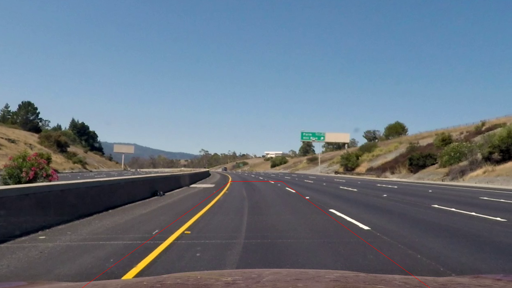
4 points used to compute transformation matrix.

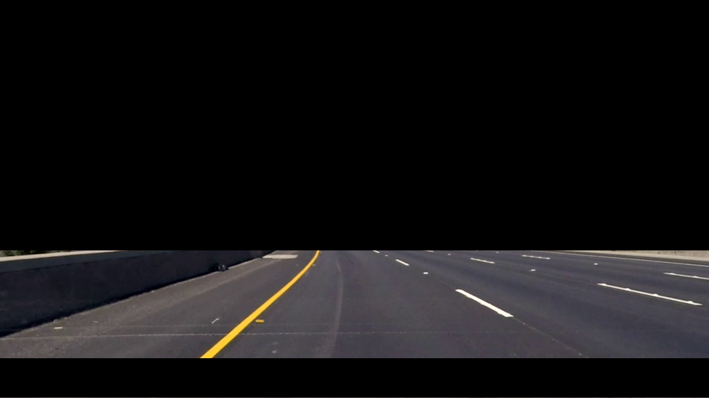
Images are masked above `0.63` and `10%` from bottom

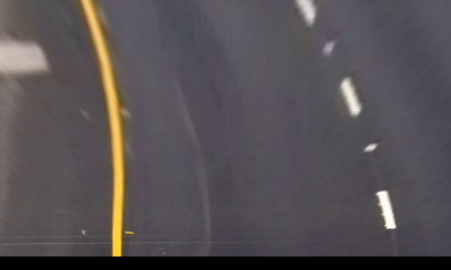
Image transformed to top view using warp perspective.

### Binarization

Binarization is done in following stepd:
1. Blur with 5x5 kernel using `cv2.filter2D`
2. Equalize histogram
  - Convert to YUV colorspace
  - Use `cv2.equalizeHist` with Y channel
  - Convert back to RGB
3. Find white lines
  - Leave only G channel
  - Black all values below 250 and set rest to 255
4. Find yellow lines
  - Use V from YUV
  - Blur with 5x5
  - Apply sobel in x and threshold
5. Merge results from 3 and 4

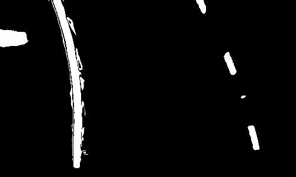

### Line fitting

Line fitting for single image or first frame of video works as follows:
1. Set `center = width/2`
2. For each line in image starting from bottom:
- Store index of each none zero point in `x_val_hist`
  - Store in `x_val_hist` index of each none zero point from row
  - If len of `x_val_hist` is greater than 0:
    - Group points to left/right line according to position to `center`
    - If there are points in *left* group:
      - Compute average
      - Add point to *points*
      - Set `center = average + width*0.2`
    - If there are points in *left* group:
      - Compute mean
      - Add point to *points*

Image below shows red, green and blue dots. Red and blue are points for left and right line fitting respectively. Green is the position of `center` which discriminates left from right points.

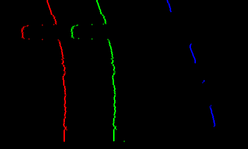

Line fitting for a video frame:
1. For every 10th row of frame starting from bottom:
  - Compute min, max of ROI for x, for left and right lines to search for points (`lxmin, lxmax, rxmin, rxmax`)
  - Store in `x_val_hist` index of each none zero point from row
  - If len of `x_val_hist` is greater than 5:
    - Group points to left/right line according to position to `lxmin, lxmax` and `rxmin, rxmax`
    - If there are points in *left* group:
      - Compute average
      - Add point to *points*
      - Set `center = average + width*0.2`
    - If there are points in *left* group:
      - Compute mean
      - Add point to *points*

If there are less than 10 points in left or right line 25 times, single image line fitting is made.

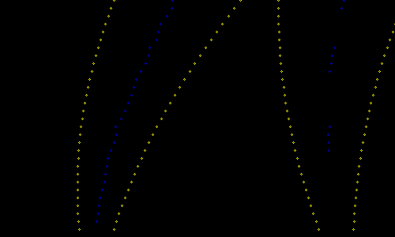

### Calculating radius / curvature and position

All radius/position related computations are made in *computeAndShow* method. Curvature is computed using code from Udacity. Position is obtained by computing the difference between center of image and center of lane in pixels. Then it is converted to meters using pixels to meters factor for x axis.

## Results

Results are saved into *results* directory.

### Results on images

Here are results on Udacity sample images.

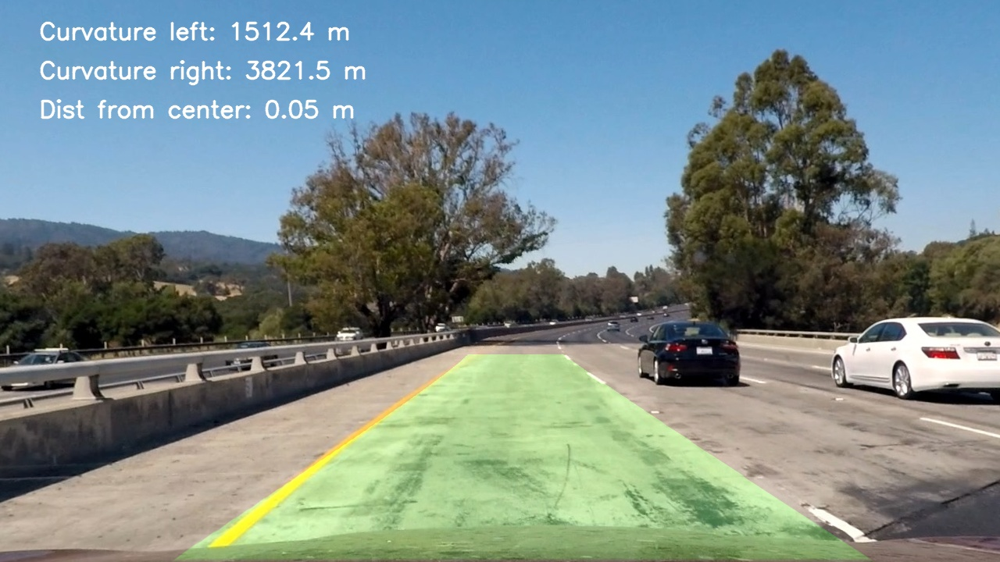

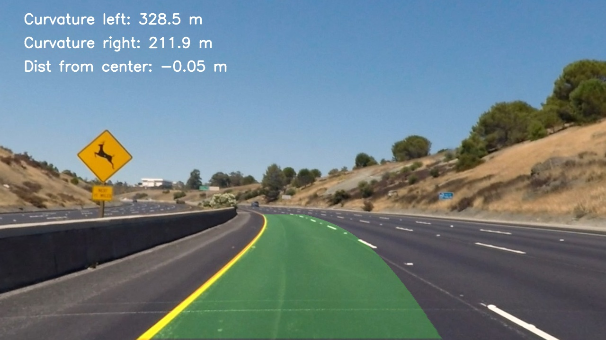

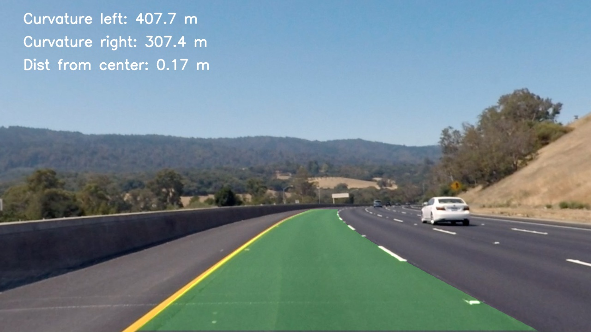

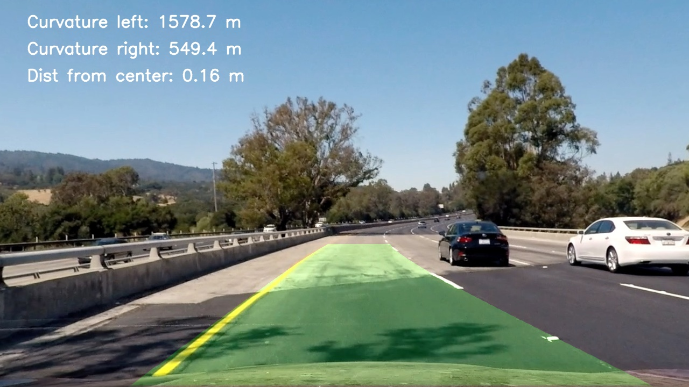

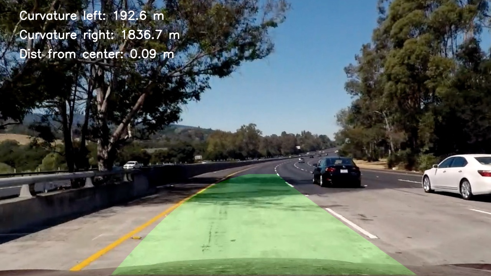

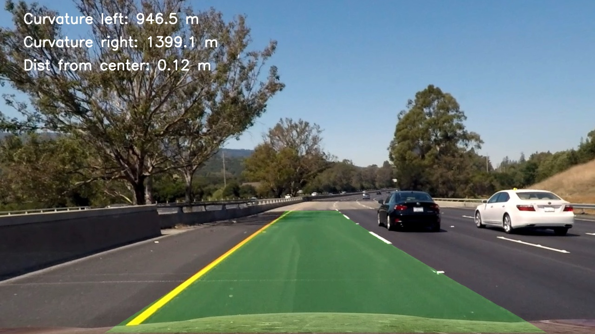

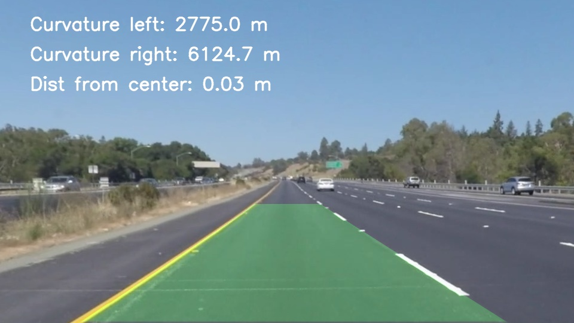

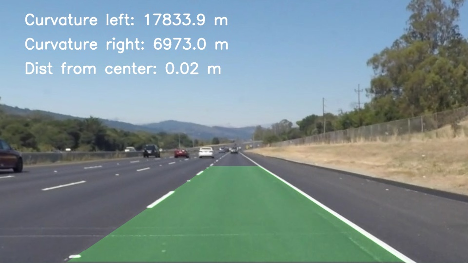

### Results on videos

Results for videos are also stored in *results* dir.

## Discussion

This solution works bad on `harder_challenge_video.mp4`. Pipeline is prepared to work on smaller curvatures. The contrast variations are really challanging and are a problem.
Improvements:
- RANSAC can be used to remove outliers to better fit polynomials.
- Deep net can be used to determine lane like for determining driveable areas of road in [this paper](https://arxiv.org/pdf/1604.02316.pdf)
- Fine tunning of binarization
- Support for small radius turns - larger ROI
- Compare the change of polynomial - reduce jumps
